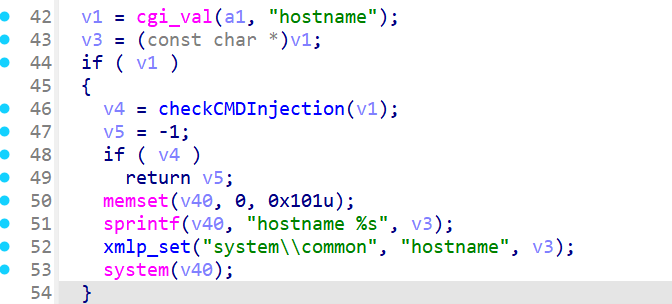

## **Basic Information**

- **Vendor:** Telesquare
- **Vendor Website:** [telesquare.co.kr/download/list](http://www.telesquare.co.kr/download/list)
- **Affected Device Type:** Router
- **Affected Product:** Tlr-2005Ksh
- **Affected Product Version:** 1.2.4


## 1. Vulnerability Overview

Telesquare Tlr-2005Ksh is a Sk Telecom LTE router from Telesquare, South Korea. There is a command injection vulnerability in its binary file internet.cgi.


## 2. Vulnerability Details

After unpacking the firmware, locate internet.cgi and open it in IDA.

In the main function, you can see that the Command parameter is controllable and can be set to lanCfg


Then in the LanCfg function, you can control the value of hostname and splice it into the system function



Although there is filtering for input commands, it is not sufficient and you can still use $(cmd) or newline characters \n to bypass restrictions and complete command injection.


## 3.POC

```shell
http://ip/cgi-bin/internet.cgi?Command=lanCfg&hostname=$(cmd)
```

